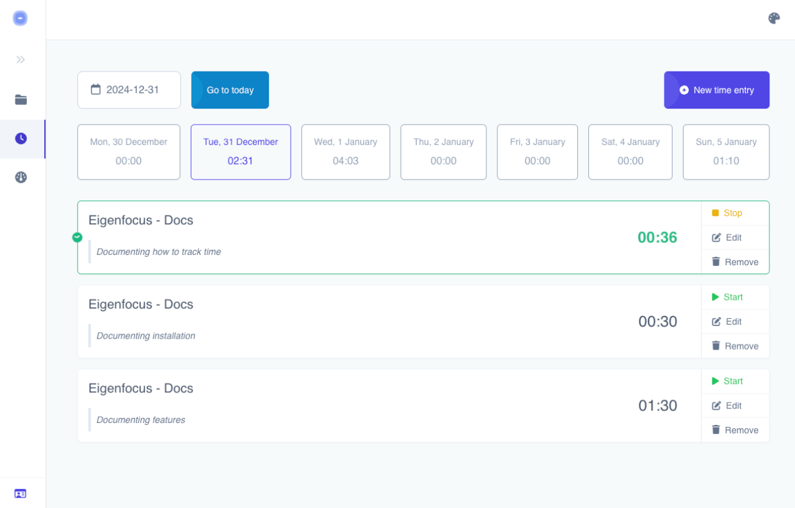

<div align="center">
    <h1><b>Eigenfocus</b></h1>
    <p>
        Free Self-Hosted All-in-One Management App: Kanban Boards, Time Tracking & Focus Tools.
    </p>
    <p>Manage your personal and work projects in one place.</p>
    <br />
    <a href="https://eigenfocus.com"><strong>Website</strong></a> |
    <a href="#installation"><strong>Installation</strong></a>
</div>
<br />

# Our Features
Here are some of our current features:

- Projects: create/edit/update/archive you projects
- Boards: each project has a board where you can customize columns to your workflow
- Issues: create issues using the project board
- Workflow with Boards: Move issues between columns
- Time Tracking: track time spent on a Project and a Specific Issue
- Time Report: generate time reports by project and time periods
- Themes: customize the UI to your taste

# Some Screenshots




# Installation
You can run our project using our docker image directly with docker or docker compose:

## Docker
```sh
docker run \
    --restart unless-stopped \
    -v ./app-data:/eigenfocus-app/app-data \
    -p 3001:3000 \
    -e DEFAULT_HOST_URL=http://localhost:3001 \
    -d \
    eigenfocus/eigenfocus:latest
```

## Docker Compose
Or using a docker compose file:

```docker-compose.yml
services:
  app:
    image: eigenfocus/eigenfocus:latest
    command: run
    restart: unless-stopped
    volumes:
      - ./app-data:/eigenfocus-app/app-data
    environment:
     - DEFAULT_HOST_URL=http://localhost:3001
    ports:
      - 3001:3000
```

Then, running it with the CLI:

```sh
docker compose run -d app
```

## Commands
To allow a more flexible setup, we have some pre configured commands on our image:

- `setup`: Prepares the application database with the latest changes. Needs to be called only once before running the application.
- `serve`: Starts the Rails App on port 3000.
- `run`: Run setup and server commands. For most cases, this is the command you need to run.

## Environment Configurations

- `DEFAULT_HOST_URL`: URL that is going to be used to access your application.
  - Example: "http://localhost:3001", "http://mydomain.com" or "https://mydomain.com"
- `FORCE_SSL`: Defaults to `false`. If set to `true`, all incoming requests that are not HTTPS will be redirected to use HTTPS protocol.
- `ASSUME_SSL_REVERSE_PROXY`: Defaults to `false`. If set to `true`, all incoming requests will be interpreted as HTTPS. This is useful for cases when you have `FORCE_SSL` set to `true` but are behind a reverse proxy that terminates the SSL. This means that our app will be receiving requests via HTTP. In order to avoid an infinite redirect loop to HTTPS you must set `ASSUME_SSL_REVERSE_PROXY` to `true`. For more information, check the conversation and changelog on https://github.com/rails/rails/pull/47139.

# Development Guide
Alternatively, if you need to fine tune a config [Check the Development Guide](docs/DEVELOPMENT.md).

# Contact
We are in *beta* and any feedbacks are welcome.

Feel free to contact us `hi@eigenfocus.com` or open a issue.

# Other
[License](LICENSE)
